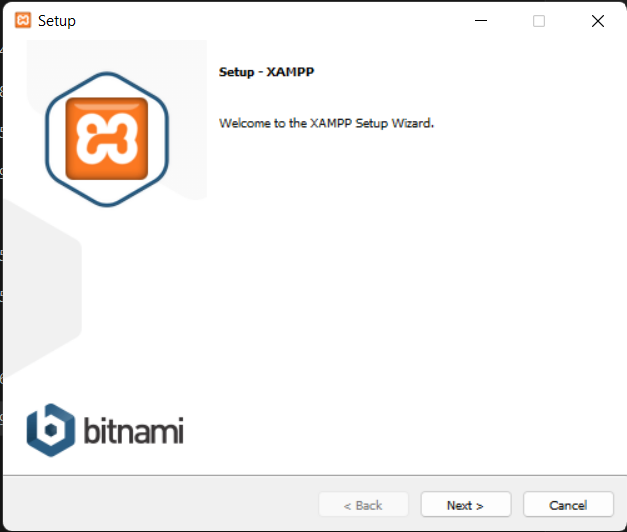
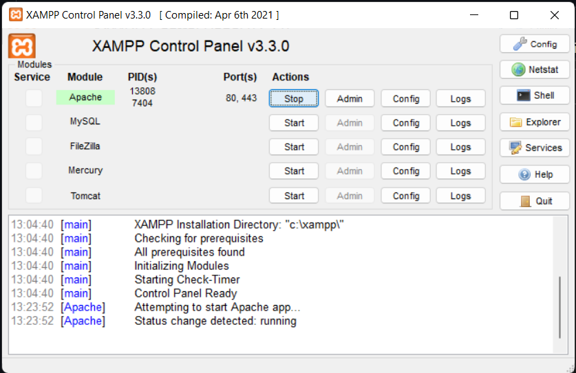
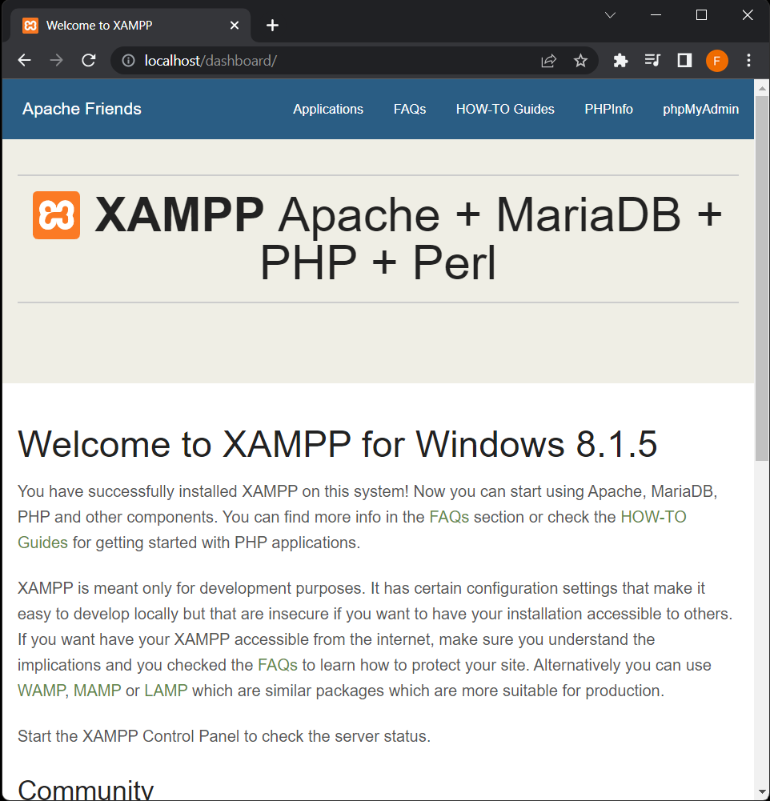
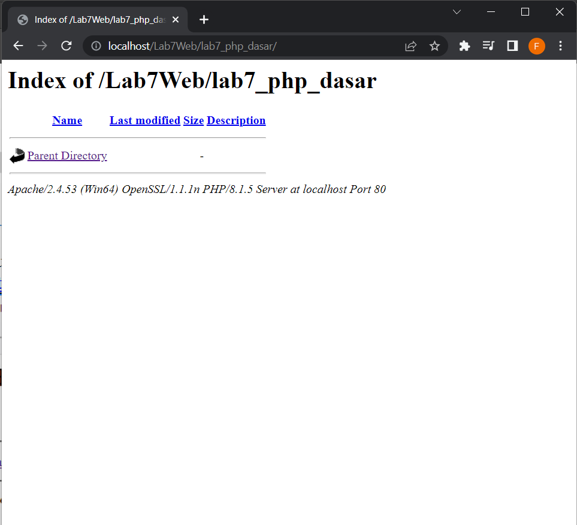
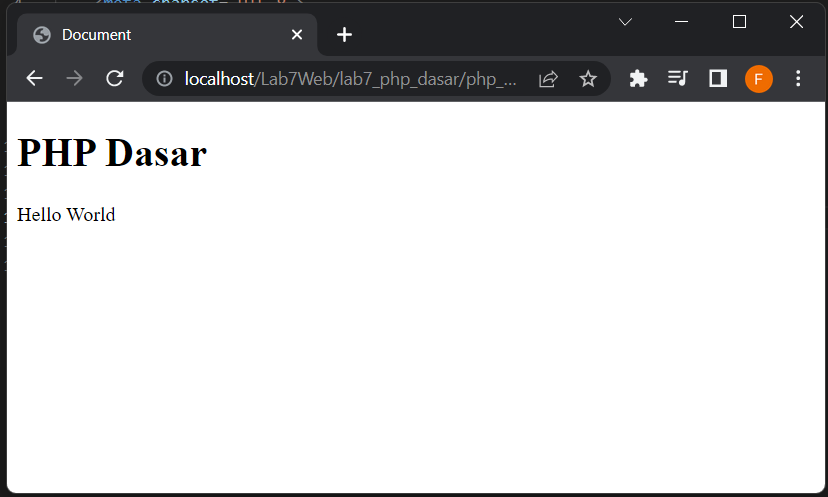
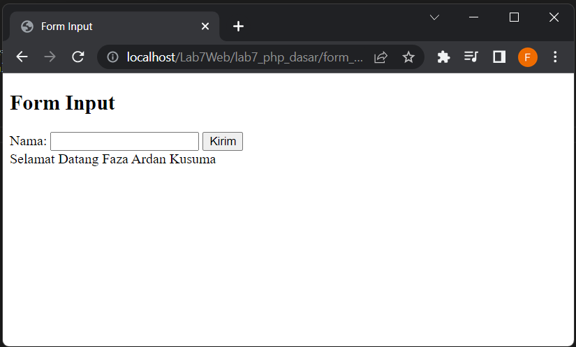
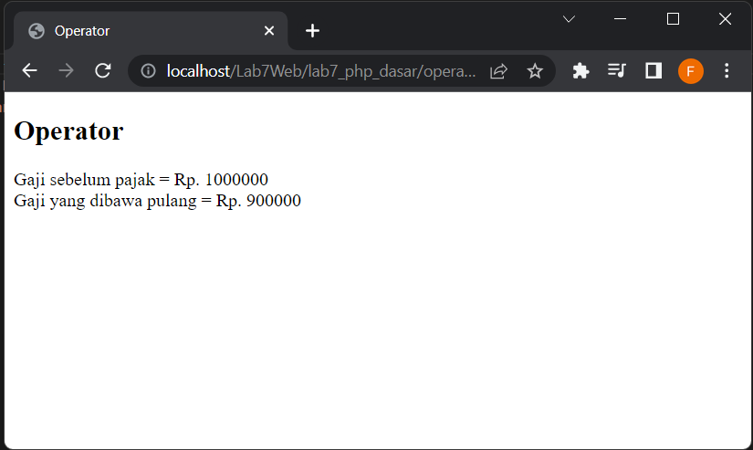
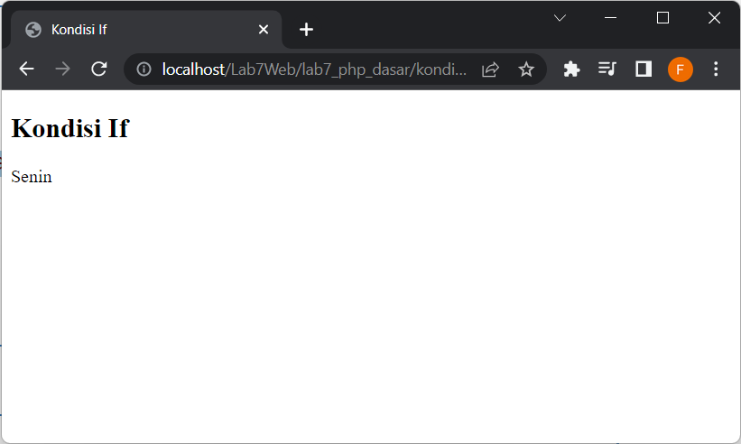
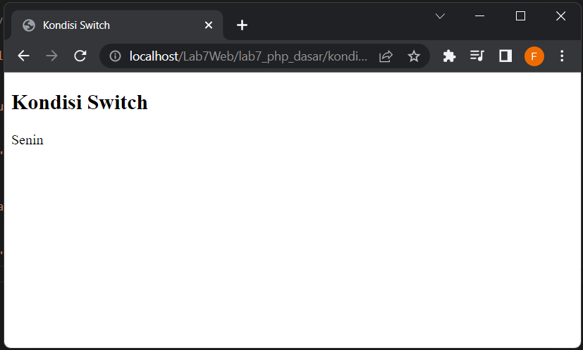

# Lab7Web
## Tugas Praktikum 6
## PHP Dasar

Nama : Faza Ardan Kusuma<br>
NIM : 312010001<br>
Kelas : TI 20 B1<br>

<hr>

## Instalasi XAMPP
Disini saya akan install terlebih dahulu untuk aplikasi XAMPP.<br>
<br><br>
Setelah selesai install <b>XAMPP</b>, lalu buka aplikasinya. Kemudian jalankan <b>Apache</b>.<br>
<br><br>

Kemudian buka <b>Web Server</b> tersebut pada browser, disini saya menggunakan <b>Google Chrome</b>. Pada google chrome, ketik http://localhost/ atau http://127.0.0.1/. Tampilan halaman tersebut seperti berikut :<br>
<br><br>

## Memulai PHP
Disini saya akan menyesuaikan folder root dierctory web server sesuai dengan folder tugas ini. Saya akan membuat folder baru dengan nama <b>lab7_php_dasar</b> pada folder <b>Lab7Web</b>. Berikut tampilannya : <br>
<br>

## PHP Dasar
Pindah pada direktori yang sudah dibuat tadi dan buat file baru dengan nama <b>php_dasar.php</b>. Pada file ini saya akan mengisinya dengan <i>Hello world</i>. Berikut syntaxnya :
```
<!DOCTYPE html>
<html lang="en">
<head>
    <meta charset="UTF-8">
    <meta http-equiv="X-UA-Compatible" content="IE=edge">
    <meta name="viewport" content="width=device-width, initial-scale=1.0">
    <title>PHP Dasar</title>
</head>
<body>
    <h1>PHP Dasar</h1>
    <?php
        echo "Hello World";
    ?>
```
Berikut outputnya :<br>
<br>

## Variable PHP
Disini saya akan membuat variable pada PHP. Untuk variable PHP menggunakan $ untuk mendifinisikan. Berikut adalah syntaxnya
```
    <?php 
        $nim = "312010001"; 
        $nama = 'Faza Ardan Kusuma'; 
        
        echo "NIM : " . $nim . "<br>"; 
        echo "Nama : $nama"; 
    ?>
```
Berikut outputnya<br>
<br>

## Predifine Variable
Pada predifine variable ini saya membuat file baru dengan nama latihan2.php lalu memasukkan syntax berikut.
```
    <?php
        echo "Selamat Datang ".$_GET['nama'];
    ?>
```
Lalu untuk mengaksesnya dengan membuka link berikut :<br>
http://localhost/Lab7Web/lab7_php_dasar/latihan2.php?nama=Faza<br>
Berikut outputnya<br>
<br>


## Membuat Form Input
Disini saya akan membuat form input. Saya akan membuat file baru dengan nama <b>form_input.php</b>. Berikut syntaxnya
```
<!DOCTYPE html>
<html lang="en">
<head>
    <meta charset="UTF-8">
    <meta http-equiv="X-UA-Compatible" content="IE=edge">
    <meta name="viewport" content="width=device-width, initial-scale=1.0">
    <title>Form Input</title>
</head>
<body>
    <h2>Form Input</h2>
    <form method="post"> 
        <label>Nama: </label> 
        <input type="text" name="nama"> 
        <input type="submit" value="Kirim"> 
    </form> 
    
    <?php 
        echo 'Selamat Datang ' . $_POST['nama']; 
    ?>
</body>
</html>
```
Disini saya menggunakan HTML dan PHP, berikut outputnya.<br>
<br>


## Operator
Disini yang akan saya buat adalah operator aritmatika, maka disini saya membuat file baru dengan nama <b>operator.php</b>. Untuk syntaxnya sebagai berikut.<br>
```
    <?php 
    $gaji = 1000000; 
    $pajak = 0.1; $thp = $gaji - ($gaji*$pajak); 
    echo "Gaji sebelum pajak = Rp. $gaji <br>"; 
    echo "Gaji yang dibawa pulang = Rp. $thp"; 
    ?>
```
Untuk outputnya, seperti berikut.<br>
<br>


## Kondisi If
Kondisi if dan else digunakan untuk memeriksa suatu nilai, bila TRUE maka kondisi if akan berjalan, bilamana False, maka kondisi ELSE yang akan dijalankan. Disini saya membuat file baru dengan syntax berikut.
```
    <?php 
    $nama_hari = date("l"); 
    if ($nama_hari == "Sunday") { 
        echo "Minggu"; 
    } elseif ($nama_hari == "Monday") { 
        echo "Senin"; 
    } else { 
        echo "Selasa"; 
    } 
    ?>
```
Tampilan output<br>
<br>

## Kondisi Switch
Kondisi SWITCH adalah percabangan / pemilihan dimana kita membandingkan isi sebuah variabel dengan beberapa nilai. Disini saya membuat file baru dengan nama <b>kondisi_switch.php</b>. Berikut syntaxnya.<br>
```
    <?php 
    $nama_hari = date("l"); 
    switch ($nama_hari) { 
        case "Sunday": 
            echo "Minggu"; 
            break; 
        case "Monday": 
            echo "Senin"; 
            break;
        case "Tuesday": 
            echo "Selasa"; 
            break; 
        default: 
            echo "Sabtu"; 
        }
    ?>
```

Tampilan outputnya.<br>
<br>

